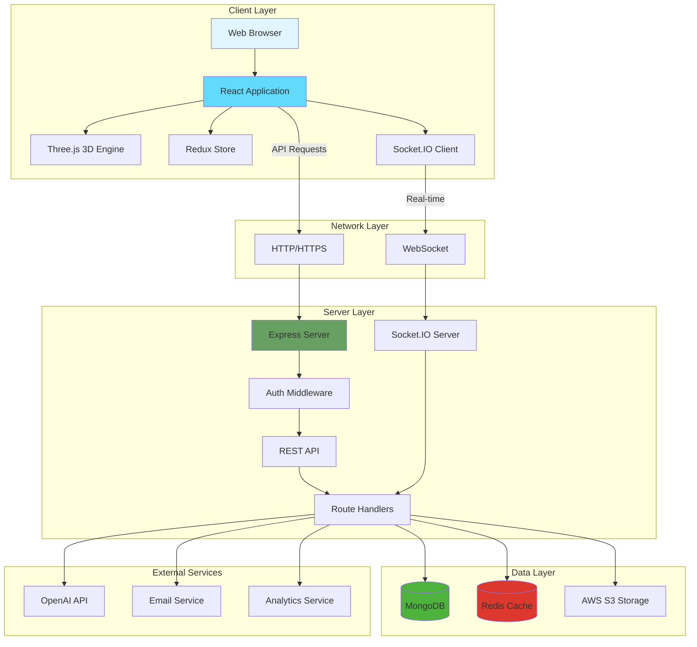
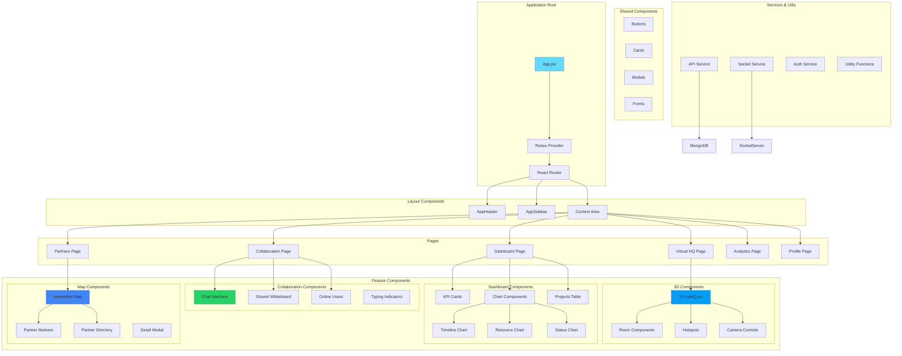
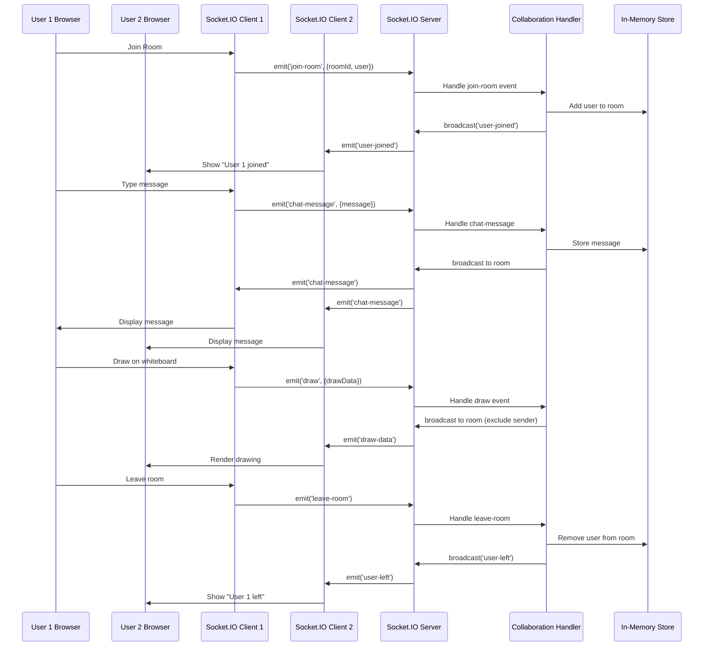
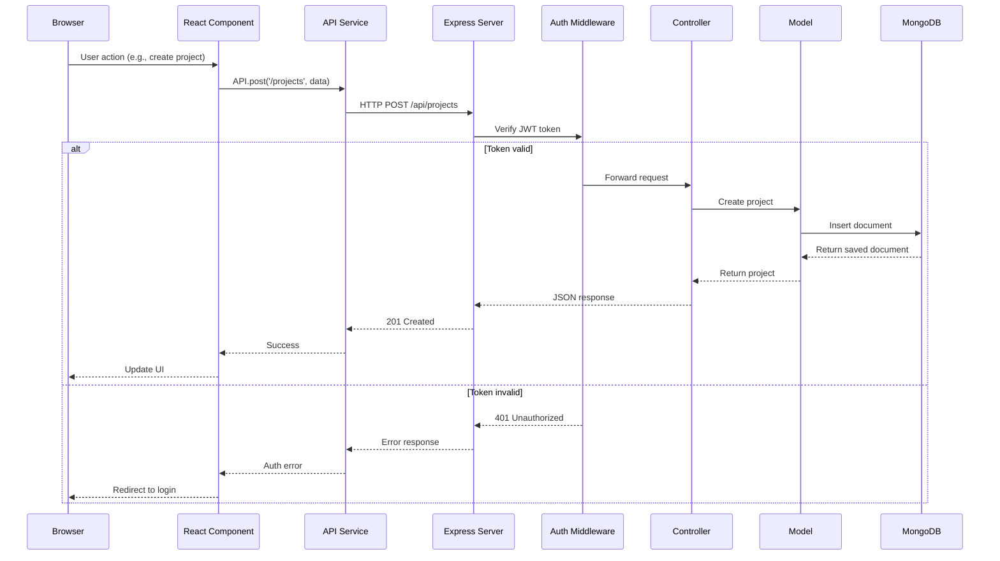
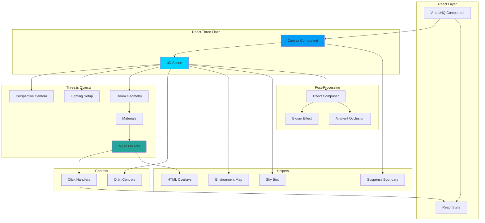
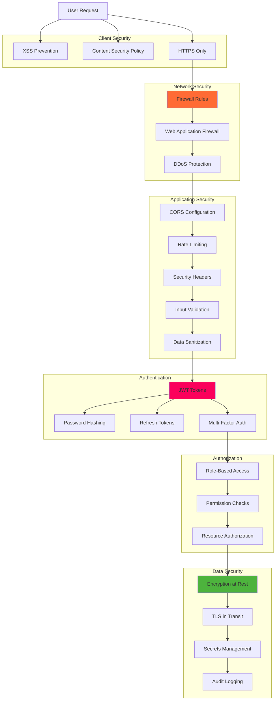
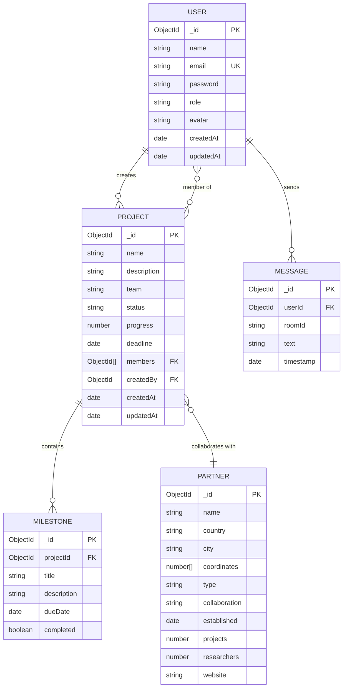

# InterNexus Architecture Diagrams

This document contains visual architecture diagrams for the InterNexus platform using Mermaid syntax.

---

## 1. System Architecture Overview

---

## 2. Frontend Component Architecture

---

## 3. Backend Architecture

```mermaid
graph TB
    subgraph "Entry Point"
        Server[server.js]
    end
    
    subgraph "Middleware Stack"
        Helmet[Helmet Security]
        CORS[CORS Handler]
        RateLimit[Rate Limiter]
        BodyParser[Body Parser]
        Auth_MW[Auth Middleware]
        ErrorHandler[Error Handler]
    end
    
    subgraph "API Routes"
        ProjectRoutes["API: /api/projects"]
        UserRoutes["API: /api/users"]
        PartnerRoutes["API: /api/partners"]
        AnalyticsRoutes["API: /api/analytics"]
    end
    
    subgraph "Controllers"
        ProjectCtrl[Project Controller]
        UserCtrl[User Controller]
        PartnerCtrl[Partner Controller]
        AnalyticsCtrl[Analytics Controller]
    end
    
    subgraph "Services"
        AuthService[Auth Service]
        AIService[AI Service]
        EmailService[Email Service]
        StorageService[Storage Service]
    end
    
    subgraph "Socket.IO"
        SocketServer[Socket.IO Server]
        CollabHandler[Collaboration Handler]
        NotifHandler[Notification Handler]
    end
    
    subgraph "Models"
        UserModel[User Model]
        ProjectModel[Project Model]
        PartnerModel[Partner Model]
        MessageModel[Message Model]
    end
    
    subgraph "Database"
        MongoDB[(MongoDB)]
        Redis[(Redis)]
    end
    
    Server --> Helmet
    Helmet --> CORS
    CORS --> RateLimit
    RateLimit --> BodyParser
    BodyParser --> Auth_MW
    
    Auth_MW --> ProjectRoutes
    Auth_MW --> UserRoutes
    Auth_MW --> PartnerRoutes
    Auth_MW --> AnalyticsRoutes
    
    ProjectRoutes --> ProjectCtrl
    UserRoutes --> UserCtrl
    PartnerRoutes --> PartnerCtrl
    AnalyticsRoutes --> AnalyticsCtrl
    
    ProjectCtrl --> AuthService
    UserCtrl --> AuthService
    ProjectCtrl --> AIService
    UserCtrl --> EmailService
    ProjectCtrl --> StorageService
    
    Server --> SocketServer
    SocketServer --> CollabHandler
    SocketServer --> NotifHandler
    
    ProjectCtrl --> ProjectModel
    UserCtrl --> UserModel
    PartnerCtrl --> PartnerModel
    CollabHandler --> MessageModel
    
    ProjectModel --> MongoDB
    UserModel --> MongoDB
    PartnerModel --> MongoDB
    MessageModel --> MongoDB
    
    AuthService --> Redis
    
    Auth_MW --> ErrorHandler
    
    style Server fill:#68a063
    style SocketServer fill:#010101
    style MongoDB fill:#4db33d
    style Redis fill:#dc382d
```

---

## 4. Data Flow: Real-time Collaboration

---

## 5. Data Flow: API Request/Response

---

## 6. Component State Management

```mermaid
graph LR
    subgraph "Component State"
        LocalState[Local useState]
        LocalEffect[useEffect]
    end
    
    subgraph "Redux Global State"
        Store[Redux Store]
        Actions[Actions]
        Reducers[Reducers]
        Middleware[Middleware]
    end
    
    subgraph "Server State"
        API[API Calls]
        Cache[Response Cache]
    end
    
    subgraph "Real-time State"
        Socket[Socket.IO]
        Events[Event Listeners]
    end
    
    Component[React Component] --> LocalState
    Component --> Store
    Component --> API
    Component --> Socket
    
    LocalState --> LocalEffect
    LocalEffect --> Component
    
    Component --> Actions
    Actions --> Middleware
    Middleware --> Reducers
    Reducers --> Store
    Store --> Component
    
    API --> Cache
    Cache --> Component
    
    Socket --> Events
    Events --> Component
    Events --> Actions
    
    style Component fill:#61dafb
    style Store fill:#764abc
    style Socket fill:#010101
```

---

## 7. 3D Virtual HQ Architecture

---

## 8. Deployment Architecture

```mermaid
graph TB
    subgraph "Development"
        DevClient[Vite Dev Server<br/>:3000]
        DevServer[Node Dev Server<br/>:5000]
        DevDB[(Local MongoDB)]
    end
    
    subgraph "CI/CD Pipeline"
        GitHub[GitHub Repository]
        Actions[GitHub Actions]
        Tests[Automated Tests]
        Build[Build Process]
    end
    
    subgraph "Production - AWS"
        subgraph "Frontend"
            S3[S3 Bucket<br/>Static Files]
            CloudFront[CloudFront CDN]
        end
        
        subgraph "Backend"
            ALB[Application Load Balancer]
            EC2_1[EC2 Instance 1]
            EC2_2[EC2 Instance 2]
        end
        
        subgraph "Data"
            Atlas[(MongoDB Atlas)]
            ElastiCache[(ElastiCache Redis)]
            S3_Storage[S3 File Storage]
        end
        
        subgraph "Monitoring"
            CloudWatch[CloudWatch Logs]
            Sentry[Sentry Error Tracking]
        end
    end
    
    subgraph "Users"
        Browser[Web Browsers]
    end
    
    DevClient --> DevServer
    DevServer --> DevDB
    
    DevClient --> GitHub
    DevServer --> GitHub
    
    GitHub --> Actions
    Actions --> Tests
    Tests --> Build
    Build --> S3
    Build --> EC2_1
    Build --> EC2_2
    
    Browser --> CloudFront
    CloudFront --> S3
    Browser --> ALB
    ALB --> EC2_1
    ALB --> EC2_2
    
    EC2_1 --> Atlas
    EC2_2 --> Atlas
    EC2_1 --> ElastiCache
    EC2_2 --> ElastiCache
    EC2_1 --> S3_Storage
    EC2_2 --> S3_Storage
    
    EC2_1 --> CloudWatch
    EC2_2 --> CloudWatch
    EC2_1 --> Sentry
    EC2_2 --> Sentry
    
    style GitHub fill:#181717
    style S3 fill:#ff9900
    style CloudFront fill:#8c4fff
    style Atlas fill:#4db33d
    style ElastiCache fill:#dc382d
```

---

## 9. Security Architecture

---

## 10. Database Schema

---

## How to View These Diagrams

### In VS Code:
1. Install "Markdown Preview Mermaid Support" extension
2. Open this file
3. Press `Ctrl+Shift+V` (Windows) or `Cmd+Shift+V` (Mac)

### Online:
1. Copy the Mermaid code
2. Visit https://mermaid.live
3. Paste and view

### In GitHub:
GitHub automatically renders Mermaid diagrams in markdown files.

---

**Note:** These diagrams represent the planned architecture. Actual implementation may vary based on specific requirements and optimizations.
